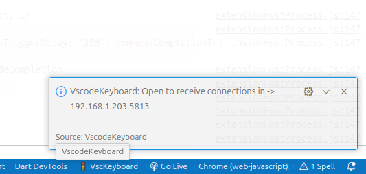
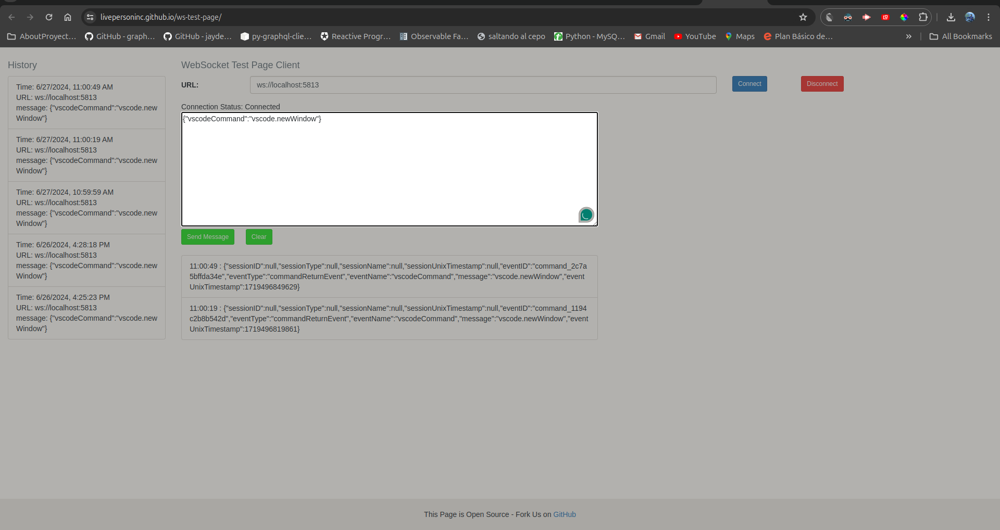
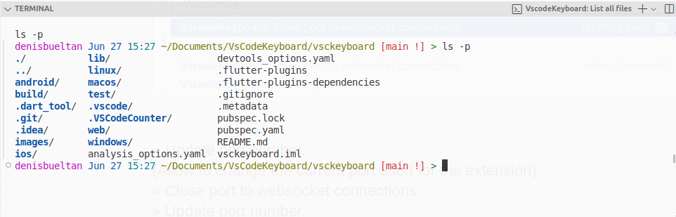
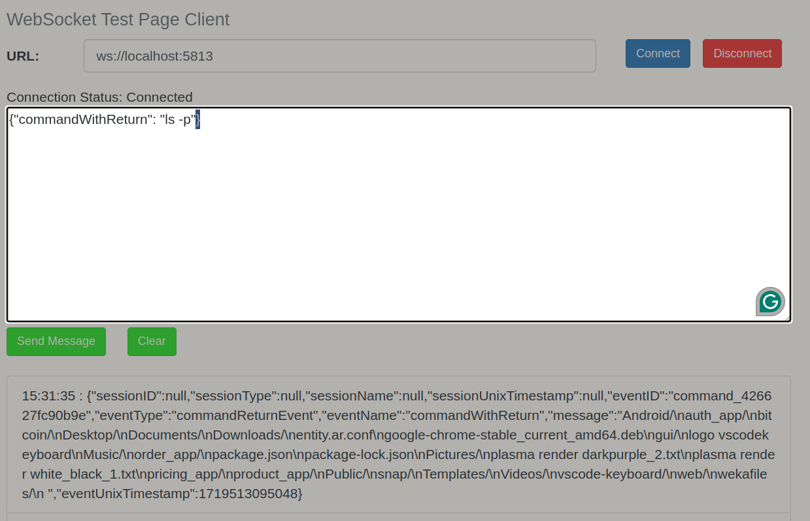
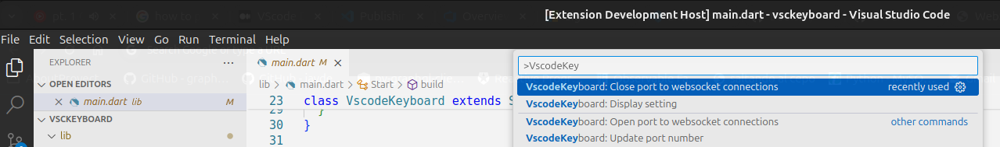

**VscodeKeyboard**

The extension provides a WebSocket interface for executing commands. It is designed to complement the web app at[ www.vscodekeyboard.com](www.vscodekeyboard.com) and the VSCodeKeyboard app for Android. The interface is also open to third-party integration. The extension is distributed under an open-source license.

The WebSocket server defaults to port 5813. Once connected to the extension, it facilitates two main functions: executing VS Code commands and providing access to the local terminal. This can include returning output or opening a new terminal tab within the VS Code interface. For a comprehensive list of available VS Code commands, please visit[ https://code.visualstudio.com/api/extension-guides/command](https://code.visualstudio.com/api/extension-guides/command). To get started, establish a connection with the WebSocket server.

In my case my local ip is:  192.168.1.203.

You can test the functionality using this tool: [https://livepersoninc.github.io/ws-test-page/](https://livepersoninc.github.io/ws-test-page/). To connect locally, use ws://localhost:5813 as the WebSocket URL. Depending on your system's security settings, you may need to open the corresponding port. On Linux, this can typically be done with the command: netstat -na | grep :5813.

**{"vscodeCommand":"vscode.newWindow"}**

If we send this message after establishing a connection, the extension will receive the message, detect the key and execute it. 

"vscode.newWindow" opens a new window (instance of vscode.)

In the case where we wan to execute commands opening a command terminal.

**{"terminalCommand": "ls -p", "terminalName": "List all files"}**

Alternatively, you can execute the command and return the result in the response message.

**{"commandWithReturn": "ls -p"}**

Example: 

## Release Notes

Release notes.

### 1.0.0
Initial Version 
 This version offer basic websocket interface.

Available functions (`Registerds Commands`) .

» Update port number. (Allow to change the current port used for the extension)

» Close port to websocket connections.

» Update port number.

» Display setting.
